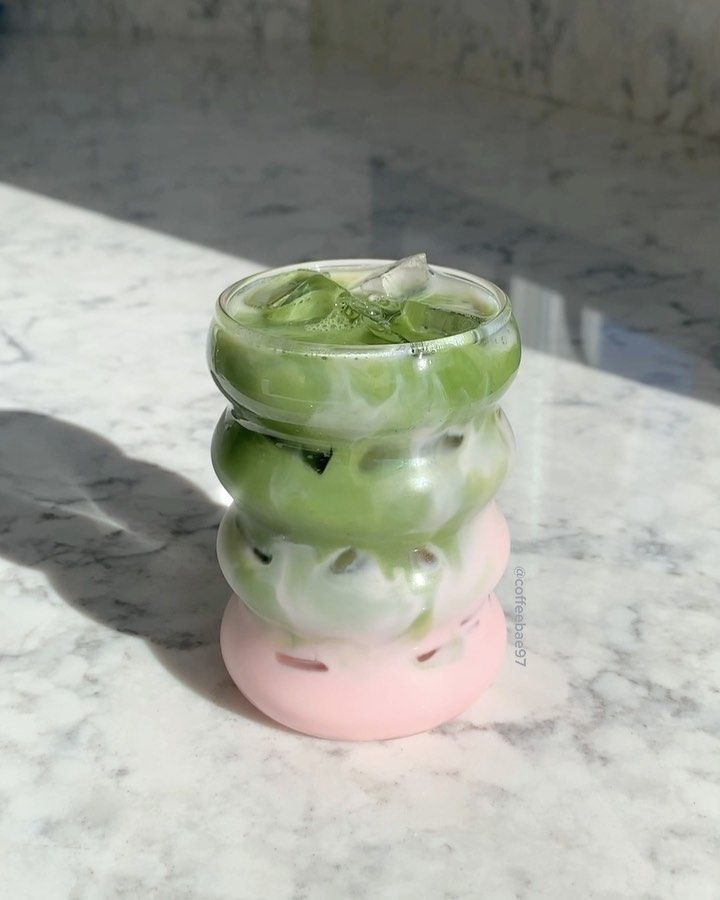
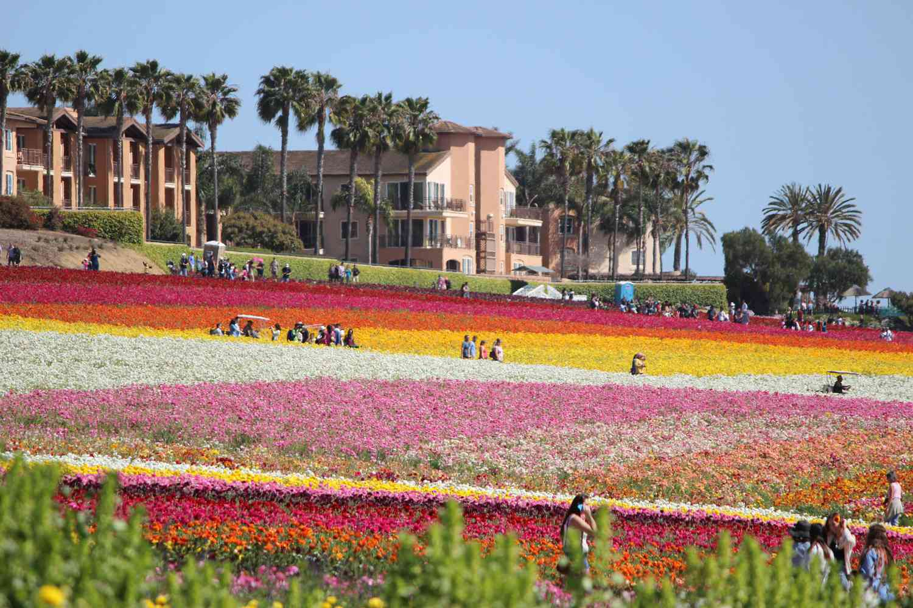

# Ghaida Alruwais's Page #
## Introduction ##
Hiii, my name is **ghaida alruwais**. I'm currently a third year computer science student at *UC San Diego*. ~Welll~ Welcome to my <ins>Github</ins> page.
## About Me ##
> "Adding manpower to a late software project makes it later", Fred Brooks
### skills ###
- Programming Languages: Python, JavaScript, C++, Swift
- Tools: Git, VS Code, Figma
- Interests: App development, AI, Data Science 
## Journey in CS ##
Here's how I started learning:
1. Learned Python in high school
2. Built simple projects like Password generator and X O game
3. Loved coding side projects and majored in computer science
## Current Tasks ##
- [x] Finish lab 1  
- [ ] watch cse 120 podcast 
- [ ] start lab 2
## Git commands used in this lab ##
```
git clone
git checkout -b
git add
git commit -m
git push
```
## In my free time ##
 
 
## Get to know me ##
- [Personal Portfolio](https://galruwaisportfolio.netlify.app/)
- [About me](#about-me)
- [Skills](#skills)

